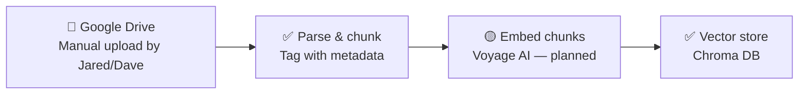
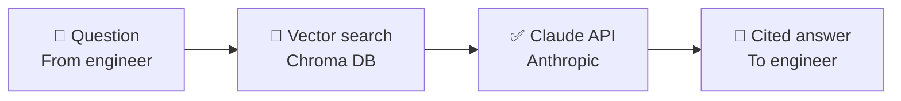

# Architecture

This diagram is meant to evolve as we build. Update it whenever a component
moves from planned → built, or when a new piece gets added — don't let it
go stale.

**Legend:** 🔲 human/manual step · ✅ built & tested · 🔵 built, awaiting a
live test on your end · 🟡 planned, not yet built

## Ingestion (getting TMs into the system)

- **Google Drive** — shared folder, organized by drivetrain system, with the
  naming convention in `docs/naming_convention.md` *(create this if we
  formalize it further)*. No live connector exists yet — see `BACKLOG.md`.
  Files are uploaded here by hand, then manually pulled in for ingestion runs.
- **Parse & chunk** — `ingestion/parse_and_chunk.py`. Tested against the
  first three real TMs. Known gap: drawings with no text layer (see
  `BACKLOG.md`) get metadata-only treatment, no searchable text chunk.
- **Embed chunks** — not yet built. Currently stubbed with TF-IDF
  (`ingestion/retrieval.py`'s `TfidfEmbedder`) so the storage/query plumbing
  could be tested without needing network access to a real embedding
  provider. Swapping in Voyage AI (Anthropic's embedding partner) is next.
- **Vector store** — Chroma, embedded directly in the pipeline
  (`ingestion/retrieval.py`). No separate hosting needed at this scale.

## Query time (engineer asks a question, gets a cited answer)

- **Vector search** — same Chroma store from ingestion. Retrieval logic
  tested with real queries against real TMs (see `BACKLOG.md` for the
  dense-table chunking gap found during testing).
- **Claude API** — `ingestion/answer_query.py`. Builds a prompt from
  retrieved excerpts, instructs Claude to answer only from those excerpts,
  and to cite document + revision + page. **Live-tested successfully
  (Aug 2026)** — correctly synthesized a multi-page procedure and honestly
  flagged a missing revision number rather than guessing at one.

## Not yet on this diagram (known future moves)

- A real hosted backend (this whole pipeline currently lives in a chat
  sandbox, not a deployed service)
- A live Google Drive connector, if/when one becomes available
- Anything supporting more than one vessel or more than a couple of testers

See `BACKLOG.md` for the reasoning behind each deferred item, and
`README.md` for the broader project state.
