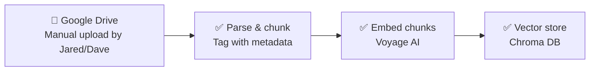
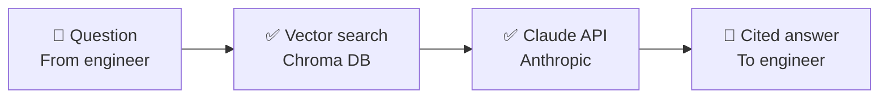
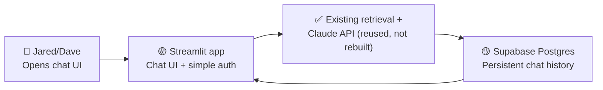

# Architecture

This diagram is meant to evolve as we build. Update it whenever a component
moves from planned → built, or when a new piece gets added — don't let it
go stale.

**Legend:** 🔲 human/manual step · ✅ built & tested · 🔵 built, awaiting a
live test on your end · 🟡 planned, not yet built

## Ingestion (getting TMs into the system)

- **Google Drive** — real shared folder now in active use (`Drivetrain TMs`),
  not just a plan. Naming convention (`[System]_[Manufacturer]_[Model]_[DocType]_Rev[X].pdf`,
  see `docs/tm_upload_checklist.md`) now includes `DWG` (renamed from the
  original `GADrawing`) and a new `RefData` catch-all doc type for reports,
  inspections, and other reference material that doesn't fit the other
  categories. No live connector exists yet — see `BACKLOG.md`. Files are
  uploaded here by hand, then pulled in via `scan_folder.py`.
- **Parse & chunk** — `ingestion/parse_and_chunk.py` + `ingestion/table_extraction.py`.
  Genuine PDFs get structured table extraction (recovers marker/checkbox
  cells that plain text loses — verified fix, see `BACKLOG.md`), not just
  plain text. Chunk IDs are now derived from the filename itself (fixed
  Aug 2026 — the old scheme, based on doc-type + equipment model, could
  silently collide across multiple files sharing both, e.g. several
  `RefData` reports for the same part — see `BACKLOG.md`). Known gap:
  drawings/scans with no text layer get metadata-only treatment, no
  searchable text chunk — currently true for 5 of the library's 14 files
  (the original thruster GA drawing and 4 single-page balancing-report
  scans; see `BACKLOG.md`'s OCR entry).
- **Embed chunks** — `ingestion/retrieval.py`. Real semantic embeddings via
  Voyage AI are the default engine, live-tested successfully both in earlier
  sandbox testing and — as of Aug 2026 — in a real run on Dave's own
  machine. TF-IDF remains available via `--engine tfidf` for offline
  testing without an API key.
- **Vector store** — Chroma, embedded directly in the pipeline. **First real,
  persistent (non-sandbox) ingestion happened Aug 2026**: all three original
  project TMs plus Jared's initial batch of 8, plus one bilingual German/English
  TM added as an ingestion test — 14 files, 155 chunks total — are now live
  in Dave's local Chroma index via `scan_folder.py`. This is also the first
  live proof that `scan_folder.py`'s `collection.add()`/`delete()` path
  (previously only unit-tested, see resolved backlog entry) works correctly
  end-to-end. One real bug was caught and fixed in this run: renaming an
  already-ingested file (without also updating the tracking manifest)
  created a silent duplicate — see `BACKLOG.md` for the fix and the still-open
  gap (rename detection isn't built into `scan_folder.py` yet).

## Query time (engineer asks a question, gets a cited answer)

- **Vector search** — same Chroma store from ingestion, now backed by real
  Voyage embeddings over the full 14-document library. Live-tested with a
  hard, broad diagnostic question ("My propulsion equipment has shut down")
  that TF-IDF completely missed but Voyage found correctly (see `BACKLOG.md`),
  and — as of Aug 2026 — with real queries against the newly-ingested GEWES
  manual, including one that correctly pulled a full 16-row torque table and
  matched the right value to the right flange size. That result is a
  positive data point against the "dense tables get lost" concern flagged
  as a priority backlog item, though not yet conclusive — see `BACKLOG.md`.
- **Claude API** — `ingestion/answer_query.py`. Builds a prompt from
  retrieved excerpts, instructs Claude to answer only from those excerpts,
  and to cite document + revision + page. Live-tested successfully,
  including correctly synthesizing an answer that drew on two different
  source documents at once (an O&M manual and a service bulletin) with
  accurate separate citations for each.

## Front end + hosting (planned, Aug 2026)

Decided Aug 2026, now that both items blocking front-end work (table-aware
chunking, rename detection) are resolved and live-verified.

- **Framework: Streamlit.** Chosen deliberately over a separate
  JS frontend + API backend — it's Python (same language as the whole
  pipeline), has chat UI primitives built in, and can call
  `retrieval.py`/`answer_query.py` logic directly as a Python import. One
  codebase, no API layer to build or keep in sync.
- **Auth:** a shared password plus a name selector — proportionate for two
  users (Dave, Jared). Full accounts/OAuth deliberately deferred until
  there's an actual need for it.
- **Persistence: Supabase (hosted Postgres).** Chosen over a simpler
  local-file option specifically because chat history needs to survive
  restarts/redeploys, and because Dave flagged a planned v2 feature —
  storing maintenance/troubleshooting field notes and findings, tied to
  specific equipment — that's a natural fit for a real relational database,
  not a file. Supabase specifically (over other Postgres options) because
  it includes `pgvector`, which opens a v2 path for making those future
  field notes semantically searchable using the same retrieval approach
  already built and tested here — without needing new infrastructure when
  that day comes. Chat messages will be tagged with the same equipment/
  vessel/doc-type vocabulary already used in citations, so v2 notes can
  link to existing identifiers rather than needing a data-model retrofit.
- **Hosting: Streamlit Community Cloud.** Free tier, deploys straight from
  the GitHub repo with minimal setup — deliberately the lowest-effort
  hosting option available, appropriate for a 2-person internal tool.
- **Ingestion stays separate from the front end.** `scan_folder.py` remains
  a Dave-run, local, command-line process — the front end is query-only.
  The ingestion pipeline is still hand-run and inspected closely on
  purpose (see resolved backlog entries — that's how real bugs kept
  getting caught), so it isn't being folded into a shared-access UI yet.

**Planned v1 feature build order:**
1. Refactor `answer_query.py`'s logic into an importable function (currently
   a CLI-only script)
2. Basic Streamlit chat UI calling that function directly
3. Citations shown with the actual retrieved excerpt inline, not just a
   page number — the highest-leverage trust-building feature identified in
   `docs/monday_discussion_guide.md`
4. Persistent history via Supabase, tagged by user
5. 👍/👎 per answer, stored alongside history — keeps some of the
   "catch bugs by inspection" visibility once answers aren't only being
   read raw in a terminal anymore
6. Copy button with two modes: plain answer, and answer-with-citations —
   deliberate choice so a copied fact doesn't lose its source when pasted
   into a maintenance log or email
7. Deploy to Streamlit Community Cloud, live-test with Jared

## Not yet on this diagram (known future moves)

- A live Google Drive connector, if/when one becomes available
- OCR/vision-based extraction for scanned reference docs and drawings —
  5 of the current 14 files have no searchable text (see `BACKLOG.md`)
- Anything supporting more than one vessel or more than a couple of testers
- **V2 idea, not yet scoped:** storing maintenance/troubleshooting field
  notes and findings from real engineers, tied to specific equipment —
  raised by Dave while deciding the front-end database (Aug 2026). Directly
  influenced the choice of Supabase (Postgres + `pgvector`) over a simpler
  option, so this remains straightforward to add later without an
  infrastructure change. Not designed or built — just flagged so the
  reasoning behind today's database choice doesn't get lost.

See `BACKLOG.md` for the reasoning behind each deferred item, and
`README.md` for the broader project state.
