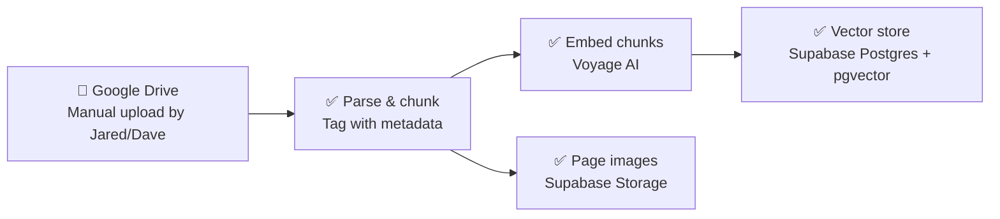
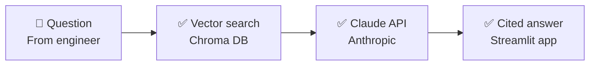
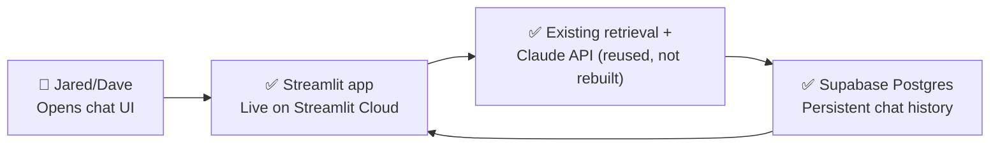

# Architecture

This diagram is meant to evolve as we build. Update it whenever a component
moves from planned → built, or when a new piece gets added — don't let it
go stale.

**Legend:** 🔲 human/manual step · ✅ built & tested · 🔵 built, awaiting a
live test on your end · 🟡 planned, not yet built

## Ingestion (getting TMs into the system)

- **Google Drive** — real shared folder in active use (`Drivetrain TMs`).
  Naming convention (`[System]_[Manufacturer]_[Model]_[DocType]_Rev[X].pdf`,
  see `docs/tm_upload_checklist.md`) now includes `DWG` and `RefData`
  catch-all doc types. No live connector exists yet — see `BACKLOG.md`.
  Files are uploaded here by hand, then pulled in via `scan_folder.py`.
- **Parse & chunk** — `ingestion/parse_and_chunk.py` + `ingestion/table_extraction.py`.
  Genuine PDFs get structured table extraction (recovers marker/checkbox
  cells that plain text loses — verified fix, see `BACKLOG.md`), not just
  plain text. Dense tables (>8 data rows) also get split into standalone
  sub-chunks so a query can match a single row instead of competing with
  a whole table-heavy page — live-verified fix, see `BACKLOG.md`. Chunk IDs
  are derived from the filename itself. Citations now include total page
  count ("p. 672 of 1415") for newly-ingested documents, clarifying that
  the number is the PDF's physical page position, not necessarily the
  document's own printed page number — see `BACKLOG.md`.
- **Embed chunks** — `ingestion/retrieval.py`. Real semantic embeddings via
  Voyage AI. Batching was rebuilt around Voyage's real per-request limits
  (hard character-based batches, not an estimated-token guess) after real
  production documents broke the earlier approach — see `BACKLOG.md` for
  the full story of that fix. TF-IDF remains available via `--engine tfidf`
  for offline testing without an API key.
- **Vector store — Supabase Postgres + `pgvector`.** Migrated Aug 2026 from
  local Chroma, which had been committed directly to git as a deployment
  stopgap; that stopgap strained badly as the library grew (a 58.92 MB
  file, a redeploy that needed a manual reboot to pick up new data) — see
  `BACKLOG.md` for the full story. Migration copied all 5,386 existing
  chunks and their already-computed embeddings directly out of the old
  Chroma database into a new `tm_chunks` table — no Voyage re-embedding
  needed. Verified at every layer: unit tests, a real full-data migration,
  local and deployed live queries, and the exact original hard test
  question repeated successfully. `scan_folder.py`'s incremental
  add/rename/delete path now writes to Postgres directly — the same
  `SUPABASE_DB_URL` secret already used for chat history, no new
  deployment config needed. **No approximate-nearest-neighbor index yet
  (plain exact search) — a real performance question is open as of Aug
  2026 (see `BACKLOG.md`), not yet root-caused between "Supabase free
  tier cold start" and "this needs a real index after all."**
- **Page images — Supabase Storage.** Added Aug 2026 — real motivating
  case: a 1415-page parts manual where diagrams (sometimes on a following
  "1 of 2 / 2 of 2" page) carry information plain text extraction can't
  capture. `ingestion/page_images.py` renders selected pages to PNG at
  ingestion time (the deployed app has no access to original PDFs, so
  this can't happen lazily at query time) and uploads them to a public
  Storage bucket. Selection logic: a page renders if it or either
  neighbor has real text — protects picture-only continuation pages from
  being skipped, without rendering every page of every document. Fully
  optional at the code level — a normal `scan_folder.py` run works
  identically whether or not Storage credentials are configured, verified
  directly. **Real gotcha, see `BACKLOG.md`:** Supabase's newer
  `sb_secret_...` API key format fails against the Storage API; the
  classic JWT-format legacy `service_role` key is required instead.
  Verified end-to-end with a real document (rendered, uploaded, cited,
  displayed correctly both via direct URL and inline in the app).
  **Still open:** no backfill yet for ~20 already-ingested documents —
  see `BACKLOG.md`.

## Query time (engineer asks a question, gets a cited answer)

- **Vector search** — same Chroma store from ingestion. Live-tested
  extensively, including two real diagnostic questions that specifically
  validate the system's core design: one where the right answer existed
  and was found correctly (a shaft-lock procedure in a 547-chunk manual),
  and one where the right answer genuinely didn't exist in the library and
  the system said so honestly rather than guessing (a missing document,
  not a retrieval bug — see `BACKLOG.md`).
- **Claude API** — `ingestion/answer_query.py`. Builds a prompt from
  retrieved excerpts, instructs Claude to answer only from those excerpts.
  Citations are generated by code from retrieval metadata (`format_sources()`),
  not by asking Claude to self-report them — more reliable, and used
  identically by both the CLI and the deployed app.

## Front end + hosting — ✅ built and deployed (Aug 2026)

Live and in real use as of Aug 2026 — deployed to Streamlit Community
Cloud, real questions asked by both Dave and Jared, real bugs found and
fixed against production data (see `BACKLOG.md`).

- **Framework: Streamlit.** Confirmed the right call in practice — one
  Python codebase, no separate API layer, fast to iterate.
- **Auth: free-text name field only — no password.** The original plan
  included a shared password; that part was never actually built, only
  the name field. Fine for now since the URL is only being shared with
  Dave and Jared directly, but **this needs revisiting before the wider
  crew (mechanics, port engineer, captain) gets access** — currently
  anyone with the link can use it with no gate at all.
- **Persistence: Supabase (hosted Postgres), live and working.** Real
  cross-session history confirmed working on the deployed app, not just
  locally — survives restarts, correctly separates conversations by user.
  👍/👎 feedback per message also live, stored per-message, toggleable.
- **Hosting: Streamlit Community Cloud.** Deployed successfully; real
  operational lesson learned: after a large data push (a big ingestion
  batch), the automatic redeploy didn't reliably pick up the new Chroma
  data — a manual **"Reboot app"** was needed to force it. Worth doing
  proactively after any significant ingestion update until the Supabase
  migration removes this dependency on committed binary data entirely.
- **Ingestion stays separate from the front end**, as planned —
  `scan_folder.py` remains a Dave-run, local, command-line process.

**v1 feature build order — all 7 steps complete:**
1. ✅ Refactored `answer_query.py` into an importable function
2. ✅ Basic Streamlit chat UI
3. ✅ Citations shown clearly (simplified to document+page after Dave's
   feedback that raw excerpt text — bilingual mixing, broken table
   formatting — looked worse than helpful; a cleaner, code-generated
   citation line replaced it)
4. ✅ Persistent history via Supabase, tagged by user
5. ✅ 👍/👎 per answer, stored alongside history
6. ✅ Copy button, two modes (plain / with sources) — known rough edge:
   clunky on iPhone, elevated to priority given confirmed ~50% mobile
   usage — see `BACKLOG.md`
7. ✅ Deployed to Streamlit Community Cloud, real live use by Jared

## Not yet on this diagram (known future moves)

- A real password/access gate before the wider crew gets the URL
- A live Google Drive connector, if/when one becomes available
- OCR/vision-based extraction for scanned reference docs and drawings —
  several library files have no searchable text (see `BACKLOG.md`); Jared's
  suggested fallback (link directly to the source page/document rather
  than requiring full OCR) is a real, simpler alternative worth weighing
- The clarifying-question feature (ask once, don't loop, per Dave's
  constraint) — fully scoped in `BACKLOG.md`, not yet built
- Torque and length unit conversions — requested by Dave, same pattern as
  the already-built temperature/pressure conversions, not yet added
- Anything supporting more than one vessel
- **V2 idea, not yet scoped:** storing maintenance/troubleshooting field
  notes and findings from real engineers, tied to specific equipment —
  directly influenced the choice of Supabase (Postgres + `pgvector`) over
  a simpler option, and now that `pgvector` is proven, working
  infrastructure (not just a future possibility — it's the actual TM
  vector store as of Aug 2026), this is even more straightforward to add
  later than originally planned.

See `BACKLOG.md` for the reasoning behind each deferred item, and
`README.md` for the broader project state.
