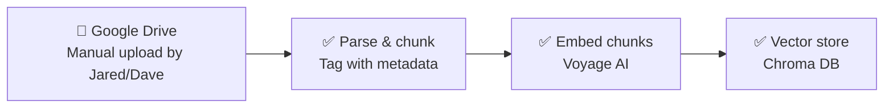
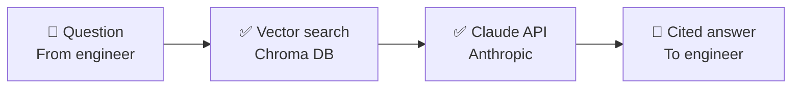

# Architecture

This diagram is meant to evolve as we build. Update it whenever a component
moves from planned → built, or when a new piece gets added — don't let it
go stale.

**Legend:** 🔲 human/manual step · ✅ built & tested · 🔵 built, awaiting a
live test on your end · 🟡 planned, not yet built

## Ingestion (getting TMs into the system)

- **Google Drive** — shared folder, organized by drivetrain system, with the
  naming convention in `docs/naming_convention.md` *(create this if we
  formalize it further)*. No live connector exists yet — see `BACKLOG.md`.
  Files are uploaded here by hand, then manually pulled in for ingestion runs.
- **Parse & chunk** — `ingestion/parse_and_chunk.py`. Tested against the
  first three real TMs. Known gap: drawings with no text layer (see
  `BACKLOG.md`) get metadata-only treatment, no searchable text chunk.
- **Embed chunks** — `ingestion/retrieval_voyage.py`. Real semantic
  embeddings via Voyage AI (Anthropic's embedding partner), live-tested
  successfully (Aug 2026) — see `BACKLOG.md`'s resolved TF-IDF entry for
  the side-by-side proof. A TF-IDF fallback (`retrieval.py`) remains
  available via `answer_query.py --engine tfidf` for offline testing
  without an API key.
- **Vector store** — Chroma, embedded directly in the pipeline. Two
  parallel collections currently exist (`chroma_db` for TF-IDF,
  `chroma_db_voyage` for real embeddings) — worth consolidating to one once
  Voyage is confirmed as the permanent choice.

## Query time (engineer asks a question, gets a cited answer)

- **Vector search** — same Chroma store from ingestion, now backed by real
  Voyage embeddings. Live-tested with a hard, broad diagnostic question
  ("My propulsion equipment has shut down") that TF-IDF completely missed;
  Voyage correctly found and cited both relevant pages across both manuals,
  verified accurate against the source text. See `BACKLOG.md`.
- **Claude API** — `ingestion/answer_query.py`. Builds a prompt from
  retrieved excerpts, instructs Claude to answer only from those excerpts,
  and to cite document + revision + page. **Live-tested successfully
  (Aug 2026)** — correctly synthesized a multi-page procedure and honestly
  flagged a missing revision number rather than guessing at one.

## Not yet on this diagram (known future moves)

- **A front end.** Deliberately not started — right now every component is
  a script you and Dave run by hand and inspect closely, which is exactly
  how real bugs (TF-IDF's blind spot, the checkbox-table risk) got caught.
  A polished interface in front of a system with known accuracy gaps would
  look more trustworthy than it is. Priority order: fix table extraction
  first (see `BACKLOG.md` — this matters more than initially scoped, since
  the full TM library is expected to have denser, more complex tables than
  the prototype set), then build a front end once retrieval accuracy is
  something the whole engineering department could rely on.
- A real hosted backend (this whole pipeline currently lives in a chat
  sandbox, not a deployed service)
- A live Google Drive connector, if/when one becomes available
- Anything supporting more than one vessel or more than a couple of testers

See `BACKLOG.md` for the reasoning behind each deferred item, and
`README.md` for the broader project state.
