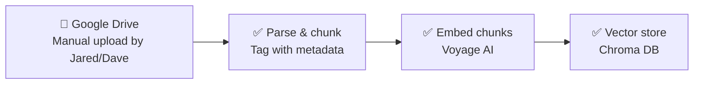
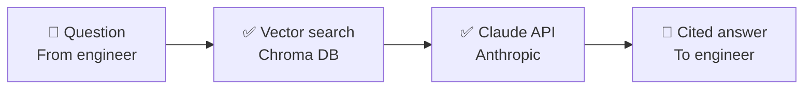

# Architecture

This diagram is meant to evolve as we build. Update it whenever a component
moves from planned → built, or when a new piece gets added — don't let it
go stale.

**Legend:** 🔲 human/manual step · ✅ built & tested · 🔵 built, awaiting a
live test on your end · 🟡 planned, not yet built

## Ingestion (getting TMs into the system)

- **Google Drive** — real shared folder now in active use (`Drivetrain TMs`),
  not just a plan. Naming convention (`[System]_[Manufacturer]_[Model]_[DocType]_Rev[X].pdf`,
  see `docs/tm_upload_checklist.md`) now includes `DWG` (renamed from the
  original `GADrawing`) and a new `RefData` catch-all doc type for reports,
  inspections, and other reference material that doesn't fit the other
  categories. No live connector exists yet — see `BACKLOG.md`. Files are
  uploaded here by hand, then pulled in via `scan_folder.py`.
- **Parse & chunk** — `ingestion/parse_and_chunk.py` + `ingestion/table_extraction.py`.
  Genuine PDFs get structured table extraction (recovers marker/checkbox
  cells that plain text loses — verified fix, see `BACKLOG.md`), not just
  plain text. Chunk IDs are now derived from the filename itself (fixed
  Aug 2026 — the old scheme, based on doc-type + equipment model, could
  silently collide across multiple files sharing both, e.g. several
  `RefData` reports for the same part — see `BACKLOG.md`). Known gap:
  drawings/scans with no text layer get metadata-only treatment, no
  searchable text chunk — currently true for 5 of the library's 14 files
  (the original thruster GA drawing and 4 single-page balancing-report
  scans; see `BACKLOG.md`'s OCR entry).
- **Embed chunks** — `ingestion/retrieval.py`. Real semantic embeddings via
  Voyage AI are the default engine, live-tested successfully both in earlier
  sandbox testing and — as of Aug 2026 — in a real run on Dave's own
  machine. TF-IDF remains available via `--engine tfidf` for offline
  testing without an API key.
- **Vector store** — Chroma, embedded directly in the pipeline. **First real,
  persistent (non-sandbox) ingestion happened Aug 2026**: all three original
  project TMs plus Jared's initial batch of 8, plus one bilingual German/English
  TM added as an ingestion test — 14 files, 155 chunks total — are now live
  in Dave's local Chroma index via `scan_folder.py`. This is also the first
  live proof that `scan_folder.py`'s `collection.add()`/`delete()` path
  (previously only unit-tested, see resolved backlog entry) works correctly
  end-to-end. One real bug was caught and fixed in this run: renaming an
  already-ingested file (without also updating the tracking manifest)
  created a silent duplicate — see `BACKLOG.md` for the fix and the still-open
  gap (rename detection isn't built into `scan_folder.py` yet).

## Query time (engineer asks a question, gets a cited answer)

- **Vector search** — same Chroma store from ingestion, now backed by real
  Voyage embeddings over the full 14-document library. Live-tested with a
  hard, broad diagnostic question ("My propulsion equipment has shut down")
  that TF-IDF completely missed but Voyage found correctly (see `BACKLOG.md`),
  and — as of Aug 2026 — with real queries against the newly-ingested GEWES
  manual, including one that correctly pulled a full 16-row torque table and
  matched the right value to the right flange size. That result is a
  positive data point against the "dense tables get lost" concern flagged
  as a priority backlog item, though not yet conclusive — see `BACKLOG.md`.
- **Claude API** — `ingestion/answer_query.py`. Builds a prompt from
  retrieved excerpts, instructs Claude to answer only from those excerpts,
  and to cite document + revision + page. Live-tested successfully,
  including correctly synthesizing an answer that drew on two different
  source documents at once (an O&M manual and a service bulletin) with
  accurate separate citations for each.

## Not yet on this diagram (known future moves)

- **A front end.** Deliberately not started — right now every component is
  a script Dave runs by hand and inspects closely, which is exactly how
  real bugs (TF-IDF's blind spot, the checkbox-table risk, and the
  rename-duplication bug) got caught. A polished interface in front of a
  system with known gaps would look more trustworthy than it is. Priority
  order: fix table extraction (still top-priority per `BACKLOG.md`, pending
  more evidence one way or the other) and rename detection, then build a
  front end once retrieval accuracy is something the whole engineering
  department could rely on.
- A real hosted backend (this whole pipeline currently runs from Dave's
  own machine via command line, not a deployed service)
- A live Google Drive connector, if/when one becomes available
- OCR/vision-based extraction for scanned reference docs and drawings —
  5 of the current 14 files have no searchable text (see `BACKLOG.md`)
- Anything supporting more than one vessel or more than a couple of testers

See `BACKLOG.md` for the reasoning behind each deferred item, and
`README.md` for the broader project state.
