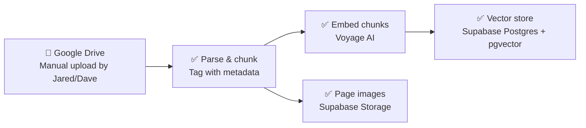
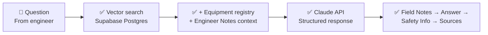
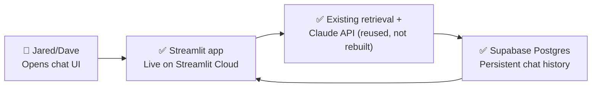

# Architecture

This diagram is meant to evolve as we build. Update it whenever a component
moves from planned → built, or when a new piece gets added — don't let it
go stale.

**Legend:** 🔲 human/manual step · ✅ built & tested · 🔵 built, awaiting a
live test on your end · 🟡 planned, not yet built

## Ingestion (getting TMs into the system)

- **Google Drive** — real shared folder in active use (`Drivetrain TMs`).
  Naming convention (`[System]_[Manufacturer]_[Model]_[DocType]_Rev[X].pdf`,
  see `docs/tm_upload_checklist.md`) now includes `DWG` and `RefData`
  catch-all doc types. No live connector exists yet — see `BACKLOG.md`.
  Files are uploaded here by hand, then pulled in via `scan_folder.py`.
- **Parse & chunk** — `ingestion/parse_and_chunk.py` + `ingestion/table_extraction.py`.
  Genuine PDFs get structured table extraction (recovers marker/checkbox
  cells that plain text loses — verified fix, see `BACKLOG.md`), not just
  plain text. Dense tables (>8 data rows) also get split into standalone
  sub-chunks so a query can match a single row instead of competing with
  a whole table-heavy page — live-verified fix, see `BACKLOG.md`. Chunk IDs
  are derived from the filename itself. Citations now include total page
  count ("p. 672 of 1415") for newly-ingested documents, clarifying that
  the number is the PDF's physical page position, not necessarily the
  document's own printed page number — see `BACKLOG.md`.
- **Embed chunks** — `ingestion/retrieval.py`. Real semantic embeddings via
  Voyage AI. Batching was rebuilt around Voyage's real per-request limits
  (hard character-based batches, not an estimated-token guess) after real
  production documents broke the earlier approach — see `BACKLOG.md` for
  the full story of that fix. TF-IDF remains available via `--engine tfidf`
  for offline testing without an API key.
- **Vector store — Supabase Postgres + `pgvector`.** Migrated Aug 2026 from
  local Chroma, which had been committed directly to git as a deployment
  stopgap; that stopgap strained badly as the library grew (a 58.92 MB
  file, a redeploy that needed a manual reboot to pick up new data) — see
  `BACKLOG.md` for the full story. Migration copied all 5,386 existing
  chunks and their already-computed embeddings directly out of the old
  Chroma database into a new `tm_chunks` table — no Voyage re-embedding
  needed. Verified at every layer: unit tests, a real full-data migration,
  local and deployed live queries, and the exact original hard test
  question repeated successfully. `scan_folder.py`'s incremental
  add/rename/delete path now writes to Postgres directly — the same
  `SUPABASE_DB_URL` secret already used for chat history, no new
  deployment config needed. **No approximate-nearest-neighbor index yet
  (plain exact search) — a real performance question is open as of Aug
  2026 (see `BACKLOG.md`), not yet root-caused between "Supabase free
  tier cold start" and "this needs a real index after all."**
- **Page images — Supabase Storage.** Added Aug 2026 — real motivating
  case: a 1415-page parts manual where diagrams (sometimes on a following
  "1 of 2 / 2 of 2" page) carry information plain text extraction can't
  capture. `ingestion/page_images.py` renders selected pages to PNG at
  ingestion time (the deployed app has no access to original PDFs, so
  this can't happen lazily at query time) and uploads them to a public
  Storage bucket. Selection logic: a page renders if it or either
  neighbor has real text — protects picture-only continuation pages from
  being skipped, without rendering every page of every document. Fully
  optional at the code level — a normal `scan_folder.py` run works
  identically whether or not Storage credentials are configured, verified
  directly. Backfilled across the whole library (~2,228 images).
  **Real gotcha, resolved (see `BACKLOG.md`):** Supabase's newer
  `sb_secret_...` API key format initially failed against the Storage
  API — the real fix was sending the key via a plain `apikey` header
  (not just `Authorization: Bearer`, which Supabase's gateway parses as
  a JWT). The project has since fully rotated onto this newer key
  format and off the legacy JWT key entirely.
- **Vessel equipment registry — know which model applies, without
  asking.** Added Aug 2026 — TMs cover a manufacturer's full model range,
  but a vessel only has one variant of each actually installed.
  `ingestion/extract_equipment_list.py` reads a real equipment list
  document and asks Claude to structure it into JSON (category,
  position, manufacturer, model, serial, flexible specs) — deliberately
  not hand-written parsing, since layouts vary vessel to vessel. Stored
  in a `vessel_equipment` Postgres table, natural key `(category,
  position)` so re-running extraction against an updated document (e.g.
  after a shipyard equipment swap) updates existing entries rather than
  duplicating. A dedicated `EquipmentList` doc type in the naming
  convention means `scan_folder.py` runs this automatically alongside
  normal chunking — no separate manual step. Directly strengthened the
  clarifying-question feature below: a question that used to require
  asking "which model do you mean?" often now gets answered directly,
  since the registry already knows what's installed.
- **Vision extraction for image-only pages.** Added Aug 2026 — drawings,
  wiring diagrams, and dense control-panel screenshots often have no text
  layer at all, so their content was previously invisible to search
  entirely. `ingestion/vision_extraction.py` sends any such page's image
  to Claude's vision API, scoped strictly to verbatim transcription of
  visible labels (not interpretation of arrows/symbols/relationships —
  see `BACKLOG.md` for the full two-tier reasoning). Runs automatically
  in `scan_folder.py` for any page with no text layer, flowing into the
  exact same chunk/embed/store pipeline as every other page. Verified
  live against a real control-panel screenshot with strong results;
  large-format engineering drawings (wide sheets) hit a real, known
  limit — Claude's vision API caps any image dimension at 8000px, which
  forces a real trade-off between fitting a big sheet whole versus
  reading its fine print clearly. A real fix (tiling a large page into
  higher-resolution sections) is scoped but deliberately not built yet
  — see `BACKLOG.md`.

## Query time (engineer asks a question, gets a cited answer)

- **Vector search — same Supabase Postgres store from ingestion**, not
  Chroma (corrected Aug 2026 — this diagram had gone stale after the
  pgvector migration). Live-tested extensively, including two real
  diagnostic questions that specifically validate the system's core
  design: one where the right answer existed and was found correctly (a
  shaft-lock procedure in a 547-chunk manual), and one where the right
  answer genuinely didn't exist in the library and the system said so
  honestly rather than guessing (a missing document, not a retrieval
  bug — see `BACKLOG.md`).
- **Equipment registry + Engineer Notes context** — both fetched fresh
  and injected into *every* question unconditionally, the same proven
  pattern for both: a question rarely names the equipment model or asks
  "is there a note about this?" explicitly, so retrieval can't be relied
  on to surface either. Degrades silently if either is empty/unreachable
  — this must never be the reason a question fails. See `BACKLOG.md` for
  both features' full build/verification stories.
- **Claude API** — `ingestion/answer_query.py`. Builds a prompt from
  retrieved excerpts plus the two context blocks above, and requires the
  response in three structured sections (`FIELD_NOTE_IDS`, `SAFETY_INFO`,
  `ANSWER`) rather than one blob of prose — this is what lets the app
  render field notes, safety information, and the answer separately, in
  a deliberate reading order (see below). Falls back gracefully to
  showing the whole response as the answer if the structure isn't
  followed exactly — this must never be the reason an answer fails to
  display. Citations themselves are generated by code from retrieval
  metadata (`format_sources()`), not by asking Claude to self-report
  them — more reliable, used identically by the CLI and the app.
- **Field Notes → Answer → Safety Info → Sources** — the answer's actual
  on-screen reading order (Aug 2026, real request from Jared and the
  Chief Engineer, after real use): a relevant Engineer Note appears
  *before* the answer (expanded by default — it can change how you
  approach a task, so it needs to be seen first), then the answer
  itself, then Safety Information (collapsed by default — real
  WARNING/CAUTION content from the source manual, kept out of the way of
  just getting an answer quickly), then a combined "View Sources"
  (citations + page images together, never dropping a source just
  because it lacks an image). See `BACKLOG.md` for the real prompt-
  wording iteration this took to get right.

## Front end + hosting — ✅ built and deployed (Aug 2026)

Live and in real use as of Aug 2026 — deployed to Streamlit Community
Cloud, real questions asked by both Dave and Jared, real bugs found and
fixed against production data (see `BACKLOG.md`).

- **Framework: Streamlit.** Confirmed the right call in practice — one
  Python codebase, no separate API layer, fast to iterate.
- **Auth: free-text name field only — no password.** Deliberately
  deferred (Aug 2026, Dave's explicit call), tied to actual rollout
  readiness rather than a fixed date — see `BACKLOG.md` for the full
  reasoning. Fine for now since the URL is only being shared with Dave
  and Jared directly, but **this needs building before the wider crew
  (mechanics, chief/port engineer, captain) gets access** — currently
  anyone with the link can use it with no gate at all.
- **Persistence: Supabase (hosted Postgres), live and working.** Real
  cross-session history confirmed working on the deployed app, not just
  locally — survives restarts, correctly separates conversations by user.
  👍/👎 feedback per message also live, stored per-message, toggleable.
  Also now stores each answer's Engineer Notes and Safety Information
  alongside it, so a reloaded past conversation replays identically to
  how it looked live.
- **Hosting: Streamlit Community Cloud.** Deployed successfully; a real
  operational lesson from early on: after a large data push, the
  automatic redeploy didn't reliably pick up new data — a manual
  **"Reboot app"** was needed to force it. The Postgres migration removed
  the original cause (committed binary data going stale), but a related
  connection-staleness issue was found and fixed later (Aug 2026, see
  `BACKLOG.md`) that may reduce or eliminate the need for this — worth
  testing next time a real deploy happens rather than assuming the old
  workaround is still necessary. Standing practice until then: reboot
  proactively after any push touching `app.py`, `db.py`, or dependencies.
- **Branding: "Fathom - Polaris."** Rebranded (Aug 2026) from a generic
  "Vessel Maintenance TM Assistant" — "Fathom" as the product name,
  "Polaris" as this specific vessel's instance, a naming pattern that
  scales cleanly if this becomes a multi-vessel product later. Real
  maritime-professional theme (deep navy + brass accent) and Streamlit's
  default developer-facing chrome (GitHub/star/edit icons, hamburger
  menu, footer) hidden — makes the app look like a finished product, not
  an obvious dev/demo project. **Real lesson from this (see
  `BACKLOG.md`):** the CSS used to hide that chrome also hid the
  sidebar's collapse/expand toggle, breaking the app on mobile (which
  starts with the sidebar collapsed) while looking completely fine on
  desktop (which starts with it open) — any future visual/CSS change
  needs to be checked on an actual phone before being considered done.
- **Engineer Notes UI** — a **"📝 + Engineer Note"** button in the
  sidebar, restricted to a small, known list of authorized names (Aug
  2026, real requirement once Jared and the Chief Engineer discussed
  these notes' real operational authority) — see `BACKLOG.md` for the
  full design and the bigger, deferred version of this (a real
  submission+approval workflow) once usage grows beyond Dave and Jared.
- **Ingestion stays separate from the front end**, as planned —
  `scan_folder.py` remains a Dave-run, local, command-line process.

**Major features built since the original v1 plan (all 7 original steps
completed first — see git history for that early build order):**
- Persistent chat history, 👍/👎 feedback, and copy — the original v1 core
- Real semantic embeddings (Voyage AI), migrated off a local Chroma
  index onto Supabase/`pgvector` for real deployment durability
- Page images — see real diagrams/tables alongside a citation, not just
  extracted text
- Vessel equipment registry — know which model applies without asking
- The clarifying-question feature — ask once, never loop, per Dave's
  constraint
- Engineer Notes — real crew experience, clearly separated from
  manufacturer data, with role-based submission authority
- The answer-layout redesign — Field Notes before the answer, Safety
  Information and combined Sources after
- The maritime rebrand — "Fathom - Polaris," professional theme, hidden
  developer chrome

## Not yet on this diagram (known future moves)

- A real password/access gate before the wider crew gets the URL —
  deliberately deferred, see `BACKLOG.md`
- A live Google Drive connector, if/when one becomes available
- OCR/vision-based extraction for scanned reference docs and drawings —
  several library files have no searchable text (see `BACKLOG.md`); Jared's
  suggested fallback (link directly to the source page/document rather
  than requiring full OCR) is a real, simpler alternative worth weighing
- Torque and length unit conversions — requested by Dave, same pattern as
  the already-built temperature/pressure conversions, not yet added
- Anything supporting more than one vessel
- The equipment dropdown (Engineer Notes and the registry) will get
  unwieldy once systems beyond drivetrain are added — a real, anticipated
  scaling issue, not urgent yet; see `BACKLOG.md` for the fix path
  (an explicit `system` field, reusing the TM naming convention's
  vocabulary)
- A second, inline entry point for Engineer Notes (attached to a
  specific answer, pre-filled from its equipment context) — deliberately
  downgraded from a planned fast-follow to "only if real usage shows
  friction," once the standalone button proved to work well on its own;
  see `BACKLOG.md`

See `BACKLOG.md` for the reasoning behind each deferred item, and
`README.md` for the broader project state.
